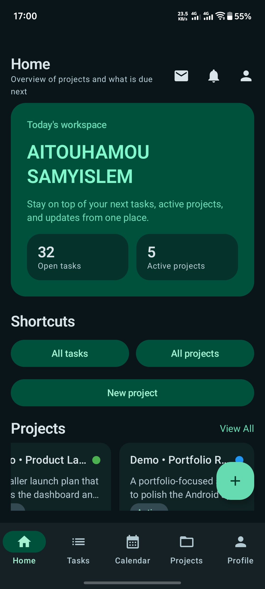
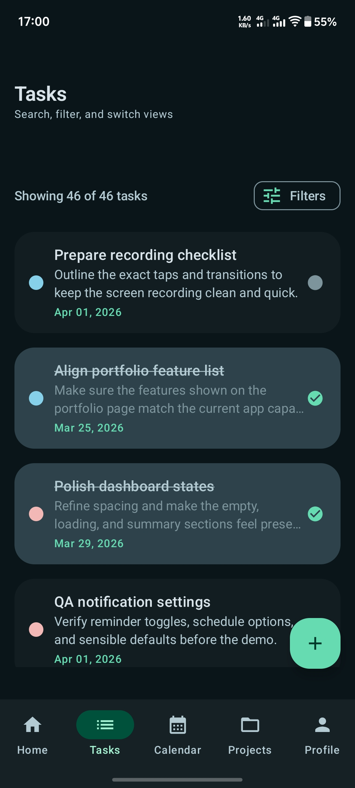
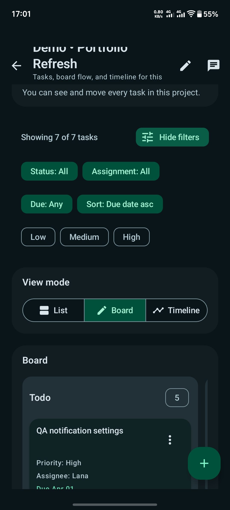
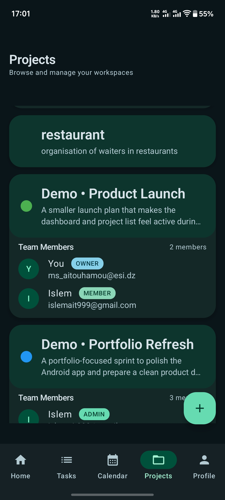
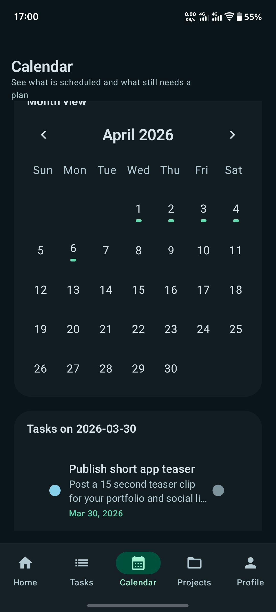
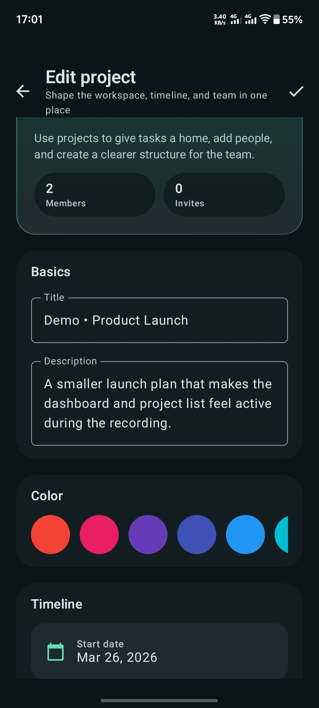

# Task Manager

Task Manager is an Android productivity app for planning personal work and collaborative projects in one place. It combines task tracking, project workspaces, calendar planning, notifications, chat, and local-first sync in a Jetpack Compose app backed by Room and Firebase.

This repo is being prepared as a polished portfolio project, so the setup is designed to be secret-safe: you can plug in your own Firebase project and run the app locally without committing credentials.

## What This Project Shows

- End-to-end Android app development with Kotlin and Jetpack Compose
- Local-first architecture with Room as the on-device source of truth
- Firebase-backed authentication, sync, messaging, and collaboration flows
- Multi-screen product design across dashboard, tasks, projects, calendar, profile, and notifications
- Testing across unit, UI, and Firebase emulator integration flows

## Feature Highlights

- Email/password and Google sign-in
- Personal dashboard with project and task summaries
- Task creation, editing, assignment, priority, due dates, subtasks, and status tracking
- Shared projects with member invitations and role-aware collaboration
- Project task views in list, board, and timeline formats
- Calendar planning for scheduled work
- In-app notifications and notification preferences
- Project and task chat
- Home screen widget for top tasks
- Background sync between Room and Firebase

## Screenshots

<table>
  <tr>
    <td align="center"><br />Dashboard overview</td>
    <td align="center"><br />Task list with filtering</td>
    <td align="center"><br />Project board and filters</td>
  </tr>
  <tr>
    <td align="center"><br />Project workspace list</td>
    <td align="center"><br />Calendar planning view</td>
    <td align="center"><br />Project editing flow</td>
  </tr>
</table>

## Tech Stack

- Kotlin
- Jetpack Compose
- Material 3
- Hilt
- Room
- WorkManager
- Firebase Auth
- Cloud Firestore
- Firebase Cloud Messaging
- Glance App Widgets

## Architecture At A Glance

- `presentation/`: Compose screens, reusable UI components, navigation, and state-driven ViewModels
- `domain/`: models plus shared query and timeline engines used across task and project screens
- `data/local/`: Room database, DAOs, and entities
- `data/remote/firebase/`: Firebase Auth and Firestore sources
- `data/repository/`: local-first repositories that coordinate local persistence and remote sync

Key design choices:

- Local-first data flow: Room is the primary on-device source of truth, while Firebase listeners and sync workers reconcile remote changes into local storage.
- Shared task querying: filtering, sorting, counts, and board grouping are centralized through a reusable task query model and engine instead of being duplicated per screen.
- Shared timeline logic: scheduled and unscheduled tasks are normalized through a common timeline engine so personal and project planning views stay aligned.
- ViewModel-owned state: composables stay focused on rendering and user events, while business rules live outside the UI layer.

## Testing

The project includes multiple layers of verification:

- Unit tests for ViewModels, repositories, mappers, domain logic, and use cases
- Instrumented Compose UI tests for screen behavior
- Firebase emulator integration tests for auth and task flows

Useful commands:

```bash
./gradlew :app:compileDebugKotlin
./gradlew :app:testDebugUnitTest
./gradlew :app:connectedDebugAndroidTest
./scripts/run-firebase-auth-integration-tests.sh
./scripts/run-firebase-task-integration-tests.sh
```

## Local Setup

### 1. Android SDK

Set `ANDROID_HOME` to your Android SDK root, or create `local.properties` with:

```properties
sdk.dir=/absolute/path/to/Android/sdk
```

### 2. Firebase Config

Copy the sample config and replace the placeholder values with your own Firebase Android app config:

```bash
cp app/google-services.example.json app/google-services.json
```

Notes:

- The Android package name is `com.saokt.taskmanager`
- Google Sign-In uses the generated Firebase `default_web_client_id`
- If Firebase config is missing, the app can still start in a limited local-only mode, but remote auth and sync features will not work fully

### 3. Optional Release Signing

Debug builds do not require release signing.

If you want to generate release builds:

```bash
cp keystore.properties.example keystore.properties
```

Then point `storeFile` to a local keystore path that is not committed.

### 4. Optional Firestore Helper Script

If you want to run the helper script under `update-firestore-emails/`:

```bash
cp update-firestore-emails/serviceAccountKey.example.json update-firestore-emails/serviceAccountKey.json
```

## Repository Safety Notes

- Do not commit `google-services.json`, `keystore.properties`, keystores, or service account keys
- Example config files are included for local setup only
- If you fork the repo, create your own Firebase project and update auth, Firestore, and FCM configuration to match your setup

## Why This Makes A Strong Portfolio Piece

- It solves a real product problem across personal planning and team collaboration
- It shows both UI craftsmanship and non-trivial app architecture
- It includes offline-capable local persistence instead of a purely network-first demo
- It demonstrates testing and environment setup, not just feature screenshots
